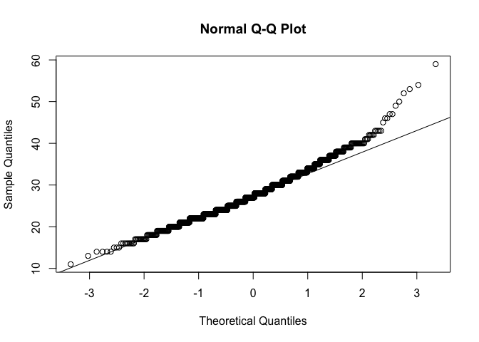

Lab-14 Replication
================
Christopher Prener, Ph.D.
(December 09, 2018)

## Introductions

This is the replication file for the lab for lecture-15.

## Dependencies

This lab requires the following packages:

``` r
library(car)      # model testing
```

    ## Loading required package: carData

``` r
library(dplyr)    # data cleaning
```

    ## 
    ## Attaching package: 'dplyr'

    ## The following object is masked from 'package:car':
    ## 
    ##     recode

    ## The following objects are masked from 'package:stats':
    ## 
    ##     filter, lag

    ## The following objects are masked from 'package:base':
    ## 
    ##     intersect, setdiff, setequal, union

``` r
library(ggplot2)  # data plotting
library(moments)  # skew and kurtosis
library(nortest)  # shapiro-francia test
```

## Data Preparation and Plotting

The data needed for the lab comes from the `testDriveR` package:

``` r
library(testDriveR)
autoData <- auto17
```

## Part 1

### Questions 1 and 2

The following code selects the requested variables from **Question 1**
and then converts the `driveStr2` variable to a favor as requested in
**Question 2**.

``` r
autoData %>%
  select(id, hwyFE, driveStr2) %>%
  mutate(driveFac = as.factor(driveStr2)) -> autoData
```

### Question 3

The following code creates a box plot of the differences in highway fuel
efficiency by
drive-train:

``` r
ggplot(data = autoData, mapping = aes(x = driveFac, y = hwyFE, fill = driveFac)) + 
  geom_boxplot() +
  labs(
    title = "Highway Fuel Efficiency by Drivetrain Type",
    subtitle = "Select American Automobiles",
    x = "Drivetrain",
    y = "Highway Fuel Efficiency (mpg)",
    caption = "Data via ggplot2\nPlot produced by Christopher Prener, Ph.D."
  ) +
  theme(legend.position="none")
```

<!-- -->

We can see from the plot that 2-wheel drive, front vehicles have the
most efficiency on the highway while other forms of drive-trains have
considerably worse fuel efficiency (with some outliers, for example, in
the 2-wheel drive, rear category).

### Question 4

The following code groups the output by drive-train type and then
calculates mean highway fuel efficiency with the grouped data:

``` r
autoData %>%
  group_by(driveFac) %>%
  summarise(count = n(), meanHwy = mean(hwyFE))
```

    ## # A tibble: 5 x 3
    ##   driveFac                count meanHwy
    ##   <fct>                   <int>   <dbl>
    ## 1 2-Wheel Drive, Front      380    32.9
    ## 2 2-Wheel Drive, Rear       340    25.4
    ## 3 4-Wheel Drive             134    23.8
    ## 4 All Wheel Drive           328    26.9
    ## 5 Part-time 4-Wheel Drive    34    19.9

The table clarifies the above plot, and also makes it clear that the low
numbers for the final category, part-time 4-wheel drive, may be driven
by few vehicles in the category.

## Part 2 - Assess Assumptions

### Question 5

The Bartlett Test is used to check the homogeneity of variance
assumption within categorical variables.

``` r
bartlett.test(hwyFE ~ driveFac, data = autoData)
```

    ## 
    ##  Bartlett test of homogeneity of variances
    ## 
    ## data:  hwyFE by driveFac
    ## Bartlett's K-squared = 67.591, df = 4, p-value = 7.316e-14

The results of the Bartlett Test (\({K}^{2} = 67.591, p < .001\))
suggest that the homogeneity of variance assumption does not hold for
these data.

### Question 6

We can evaluate normality using skew, kurtosis, a Q-Q plot, and the
Shapiro-Francia test:

``` r
skewness(autoData$hwyFE)
```

    ## [1] 0.6214349

``` r
kurtosis(autoData$hwyFE)
```

    ## [1] 4.104682

Both the skewness and kurtosis values are well within the acceptable
limits for a distribution to be considered normal.

``` r
qqnorm(autoData$hwyFE); qqline(autoData$hwyFE)
```

<!-- -->

There are some deviations from normal in the q-q plot, but only in one
tail.

``` r
sf.test(autoData$hwyFE)
```

    ## 
    ##  Shapiro-Francia normality test
    ## 
    ## data:  autoData$hwyFE
    ## W = 0.97688, p-value = 6.494e-12

Unsurprisingly, given the q-q plot, the Shapiro-Francia test
(\(W = .977, p < .001\)) is statistically significant. This suggests
that the distribution may not be normally distributed.

On the whole, the data suggest that there may be some minor deviations
from normal in the distribution but that these are not large. Overall,
the variable appears normally distributed.

## Part 3 - Fit the ANOVA

### Question 7

The following code fits the ANOVA model and stores in an object named
`model`. The findings are then summarized.

``` r
model <- aov(hwyFE ~ driveFac, data = autoData)
summary(model)
```

    ##               Df Sum Sq Mean Sq F value Pr(>F)    
    ## driveFac       4  16376    4094   180.4 <2e-16 ***
    ## Residuals   1211  27480      23                   
    ## ---
    ## Signif. codes:  0 '***' 0.001 '**' 0.01 '*' 0.05 '.' 0.1 ' ' 1

The model’s results suggest that there is substantial variation in
highway fuel efficiency by drive-train type (\(f = 180.4; p < .001\)).

### Question 8

We can use the Tukey HSD test to identify the combinations of
drive-train comparisons for which there is a statistically significant
difference in average highway fuel efficiency:

``` r
TukeyHSD(model)
```

    ##   Tukey multiple comparisons of means
    ##     95% family-wise confidence level
    ## 
    ## Fit: aov(formula = hwyFE ~ driveFac, data = autoData)
    ## 
    ## $driveFac
    ##                                                    diff         lwr
    ## 2-Wheel Drive, Rear-2-Wheel Drive, Front      -7.510836  -8.4823103
    ## 4-Wheel Drive-2-Wheel Drive, Front            -9.109387 -10.4168633
    ## All Wheel Drive-2-Wheel Drive, Front          -5.959724  -6.9405327
    ## Part-time 4-Wheel Drive-2-Wheel Drive, Front -12.996130 -15.3256439
    ## 4-Wheel Drive-2-Wheel Drive, Rear             -1.598551  -2.9259265
    ## All Wheel Drive-2-Wheel Drive, Rear            1.551112   0.5439293
    ## Part-time 4-Wheel Drive-2-Wheel Drive, Rear   -5.485294  -7.8260346
    ## All Wheel Drive-4-Wheel Drive                  3.149663   1.8154414
    ## Part-time 4-Wheel Drive-4-Wheel Drive         -3.886743  -6.3857019
    ## Part-time 4-Wheel Drive-All Wheel Drive       -7.036406  -9.3810358
    ##                                                      upr     p adj
    ## 2-Wheel Drive, Rear-2-Wheel Drive, Front      -6.5393615 0.0000000
    ## 4-Wheel Drive-2-Wheel Drive, Front            -7.8019112 0.0000000
    ## All Wheel Drive-2-Wheel Drive, Front          -4.9789154 0.0000000
    ## Part-time 4-Wheel Drive-2-Wheel Drive, Front -10.6666162 0.0000000
    ## 4-Wheel Drive-2-Wheel Drive, Rear             -0.2711762 0.0091046
    ## All Wheel Drive-2-Wheel Drive, Rear            2.5582945 0.0002682
    ## Part-time 4-Wheel Drive-2-Wheel Drive, Rear   -3.1445537 0.0000000
    ## All Wheel Drive-4-Wheel Drive                  4.4838851 0.0000000
    ## Part-time 4-Wheel Drive-4-Wheel Drive         -1.3877836 0.0002238
    ## Part-time 4-Wheel Drive-All Wheel Drive       -4.6917762 0.0000000

Every possible combination of comparisons is statistically significant,
suggesting that there are substantial differences in the fuel efficiency
between different types of automobile drive-trains.

## Part 4 - Check for Outliers

### Question 9

Finally, we should check for outliers as it is another key assumption of
ANOVA:

``` r
outlierTest(model)
```

    ##      rstudent unadjusted p-value Bonferonni p
    ## 615  5.551764         3.4729e-08   4.2231e-05
    ## 614  4.468208         8.6262e-06   1.0490e-02
    ## 1083 4.253118         2.2706e-05   2.7610e-02

The results of the Bonferonni test suggest that there may be a number of
outliers (at least 3) that are worthy of further exploration and
possible exclusion from a re-fit ANOVA model.
